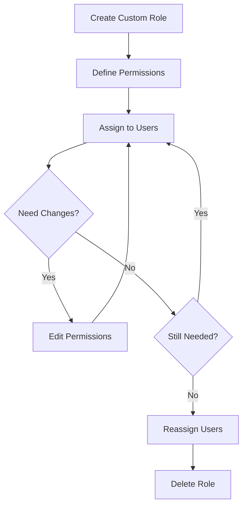

# Custom Roles Implementation Guide

## 🎯 Overview

Product Admin can now **create custom roles** with tailored permissions for their organization. This allows complete flexibility in role-based access control beyond the 11 built-in system roles.

---

## ✅ What's New

### **Custom Role Creation**
- ✅ Create unlimited custom roles
- ✅ Define role name and display name
- ✅ Add optional description
- ✅ Configure granular permissions
- ✅ Assign to users
- ✅ Edit permissions anytime
- ✅ Delete unused roles

### **Full CRUD Operations**
- **Create**: New roles with custom permissions
- **Read**: View all custom roles alongside system roles
- **Update**: Edit role permissions
- **Delete**: Remove unused custom roles (with safety checks)

---

## 🚀 How to Create a Custom Role

### Step 1: Access Role Management
1. Login as **Product Admin**
2. Navigate to **User & Role Management**
3. Click the **Role Permissions** tab
4. Scroll to **Custom Roles** section

### Step 2: Create New Role
1. Click **"Create Role"** button
2. Fill in the form:
   - **Role Name (Internal)**: `project-manager` (lowercase, hyphens)
   - **Display Name**: `Project Manager` (human-readable)
   - **Description**: "Manages projects and team assignments" (optional)

### Step 3: Configure Permissions
Select permissions from 7 categories:

#### **Dashboard & Analytics**
- ☐ Access Dashboard
- ☐ View System Analytics
- ☐ View Platform Metrics

#### **Employee Management**
- ☐ View Employees
- ☐ Manage Employees (Add/Edit/Delete)
- ☐ Access Employee Modules (Docs, Leave, Performance)

#### **Client Management**
- ☐ Manage Clients

#### **Immigration**
- ☐ Manage Immigration Cases

#### **Licensing & Certifications**
- ☐ Manage Business Licensing

#### **Timesheets & Invoicing**
- ☐ View Timesheets
- ☐ Manage Timesheets & Invoices

#### **System Administration**
- ☐ Manage Users
- ☐ Access Organization Settings
- ☐ Manage Subscriptions
- ☐ Manage Organizations

### Step 4: Save & Use
1. Click **"Create Role"**
2. Role appears in Custom Roles section
3. Assign to users via **Edit User** dialog

---

## 📊 Custom Role Features

### **Visual Indicators**
- **Purple border** on custom role cards
- **"Custom" badge** in role lists
- **Shield icon** (purple) for custom roles
- **Permission count** displayed on cards

### **Management Options**
Each custom role card shows:
- Role display name
- Number of permissions
- Top 3 key permissions
- **Edit button**: Modify permissions
- **Delete button**: Remove role

### **Safety Features**
- ✅ **Name validation**: Cannot use system role names
- ✅ **Uniqueness check**: No duplicate role names
- ✅ **User protection**: Cannot delete roles assigned to users
- ✅ **Confirmation dialogs**: Prevent accidental deletion
- ✅ **Error messages**: Clear feedback on issues

---

## 💼 Example Custom Roles

### **1. Project Manager**
```
Role Name: project-manager
Display Name: Project Manager
Description: Manages project assignments and team coordination

Permissions:
✓ Access Dashboard
✓ View Employees
✓ Manage Clients
✓ View Timesheets
✓ Access Organization Settings
```

### **2. Compliance Officer**
```
Role Name: compliance-officer
Display Name: Compliance Officer
Description: Oversees immigration and licensing compliance

Permissions:
✓ Access Dashboard
✓ View Employees
✓ Manage Immigration Cases
✓ Manage Business Licensing
✓ Access Employee Modules
```

### **3. Finance Coordinator**
```
Role Name: finance-coordinator
Display Name: Finance Coordinator
Description: Handles invoicing and expense management

Permissions:
✓ Access Dashboard
✓ View Employees
✓ View Timesheets
✓ Manage Timesheets & Invoices
✓ View System Analytics
```

### **4. Department Head**
```
Role Name: department-head
Display Name: Department Head
Description: Departmental leadership with team oversight

Permissions:
✓ Access Dashboard
✓ View Employees
✓ Manage Employees
✓ Access Employee Modules
✓ View Timesheets
✓ Manage Clients
```

### **5. Client Success Manager**
```
Role Name: client-success-manager
Display Name: Client Success Manager
Description: Client relationship and project management

Permissions:
✓ Access Dashboard
✓ View Employees
✓ Manage Clients
✓ View Timesheets
```

---

## 🔧 Technical Details

### **API Endpoints**

#### Get All Custom Roles
```http
GET /make-server-f8517b5b/custom-roles
Authorization: Bearer {publicAnonKey}

Response:
[
  {
    "id": "uuid",
    "roleName": "project-manager",
    "displayName": "Project Manager",
    "description": "Manages projects",
    "permissions": { ... },
    "isCustom": true,
    "createdAt": "2025-01-15T10:00:00Z",
    "updatedAt": "2025-01-15T10:00:00Z"
  }
]
```

#### Create Custom Role
```http
POST /make-server-f8517b5b/custom-roles
Authorization: Bearer {publicAnonKey}
Content-Type: application/json

Body:
{
  "roleName": "project-manager",
  "displayName": "Project Manager",
  "description": "Manages projects",
  "permissions": {
    "canAccessDashboard": true,
    "canViewEmployees": true,
    "canManageClients": true
  }
}

Response: 201 Created
{
  "id": "uuid",
  "roleName": "project-manager",
  ...
}
```

#### Update Custom Role
```http
PUT /make-server-f8517b5b/custom-roles/{id}
Authorization: Bearer {publicAnonKey}
Content-Type: application/json

Body:
{
  "displayName": "Senior Project Manager",
  "description": "Updated description",
  "permissions": { ... }
}

Response: 200 OK
```

#### Delete Custom Role
```http
DELETE /make-server-f8517b5b/custom-roles/{id}
Authorization: Bearer {publicAnonKey}

Response: 200 OK (if no users assigned)
Response: 400 Bad Request (if users have this role)
```

### **Data Storage**

Custom roles stored in KV store with prefix:
```
Key: custom-role:{uuid}
Value: {
  id: string,
  roleName: string,
  displayName: string,
  description: string,
  permissions: object,
  isCustom: true,
  createdAt: string,
  updatedAt: string
}
```

### **Validation Rules**

1. **Role Name**:
   - Must be unique
   - Cannot match system role names
   - Lowercase with hyphens recommended

2. **Display Name**:
   - Required
   - Human-readable format
   - Any characters allowed

3. **Deletion**:
   - Only allowed if no users have the role
   - Returns error with user count if assigned

---

## 🎨 UI Components

### **Role Permissions Tab Layout**

```
┌─────────────────────────────────────────────────┐
│  System Roles                                   │
│  Built-in roles with predefined permissions     │
│  ┌────────┐ ┌────────┐ ┌────────┐              │
│  │ Admin  │ │   HR   │ │Employee│ ... (11)     │
│  └────────┘ └────────┘ └────────┘              │
└─────────────────────────────────────────────────┘

┌─────────────────────────────────────────────────┐
│  Custom Roles                    [Create Role]  │
│  X custom roles created                         │
│  ┌─────────────┐ ┌─────────────┐               │
│  │ Project     │ │ Compliance  │               │
│  │ Manager     │ │ Officer     │               │
│  │ [Custom]    │ │ [Custom]    │               │
│  │ Edit Delete │ │ Edit Delete │               │
│  └─────────────┘ └─────────────┘               │
└─────────────────────────────────────────────────┘
```

### **Create Role Dialog**

```
┌─────────────────────────────────────────────────┐
│  Create Custom Role                         [X] │
├─────────────────────────────────────────────────┤
│  Role Name (Internal) *                         │
│  [project-manager                           ]   │
│  Lowercase, no spaces (use hyphens)             │
│                                                  │
│  Display Name *                                 │
│  [Project Manager                           ]   │
│  Human-readable name shown in the UI            │
│                                                  │
│  Description                                    │
│  [Manages projects and team assignments     ]   │
│  ────────────────────────────────────────────   │
│                                                  │
│  Permissions                                    │
│  Select what this role can access and manage    │
│                                                  │
│  Dashboard & Analytics                          │
│    ☑ Access Dashboard                           │
│    ☐ View System Analytics                      │
│                                                  │
│  Employee Management                            │
│    ☑ View Employees                             │
│    ☐ Manage Employees                           │
│    ...                                          │
│                                                  │
│                              [Cancel] [Create]  │
└─────────────────────────────────────────────────┘
```

---

## 📋 Use Cases

### **Use Case 1: Create Project Manager Role**

**Scenario**: Need a role for team leads who manage projects but don't need full HR access

**Steps**:
1. Click "Create Role"
2. Enter:
   - Role Name: `project-manager`
   - Display Name: `Project Manager`
3. Enable permissions:
   - ✓ Access Dashboard
   - ✓ View Employees
   - ✓ Manage Clients
   - ✓ View Timesheets
4. Click "Create Role"
5. Assign to team leads

### **Use Case 2: Edit Custom Role Permissions**

**Scenario**: Project Managers now need to approve timesheets

**Steps**:
1. Find "Project Manager" in Custom Roles
2. Click "Edit" button
3. Enable "Manage Timesheets & Invoices"
4. Click "Save Permissions"
5. All Project Managers immediately get new permission

### **Use Case 3: Delete Unused Role**

**Scenario**: "Finance Coordinator" role no longer needed

**Steps**:
1. Find role card
2. Click "Delete" button
3. System checks for users:
   - ✅ No users → Role deleted
   - ❌ Users exist → Error message with count
4. If users exist, reassign them first

### **Use Case 4: Assign Custom Role to User**

**Scenario**: Promote employee to Project Manager

**Steps**:
1. Go to "Users" tab
2. Find employee
3. Click "Edit"
4. Select role dropdown
5. Choose "Project Manager" under "Custom Roles"
6. Click "Save Changes"
7. User gets Project Manager permissions

---

## 🔐 Security & Access Control

### **Permission Inheritance**
- Custom roles start with NO permissions
- Must explicitly enable each permission
- Changes apply immediately to all users with that role

### **System Protection**
- Cannot create custom role with system role name
- Cannot modify system role structure
- System roles always available

### **User Safety**
- Cannot delete role assigned to users
- Must reassign users before deletion
- Confirmation dialogs prevent accidents

### **Audit Trail**
- All role changes logged in backend
- CreatedAt and UpdatedAt timestamps tracked
- User role changes logged with old/new values

---

## 📊 Statistics Update

The stats bar now shows:

```
┌────────┬────────┬────────┬────────┬────────┐
│ Total  │ Active │  Org   │Custom  │Suspend │
│ Users  │ Users  │        │ Roles  │        │
│  127   │   89   │   6    │   3    │   12   │
└────────┴────────┴────────┴────────┴────────┘
```

**Custom Roles** stat shows number of custom roles created.

---

## 🎓 Best Practices

### **Naming Conventions**
✅ **DO**:
- Use descriptive names: `project-manager`, `compliance-officer`
- Keep role names lowercase with hyphens
- Use clear display names: "Project Manager", "Compliance Officer"

❌ **DON'T**:
- Use generic names: `role1`, `test`
- Mix case in role names: `ProjectManager`
- Create duplicate roles

### **Permission Assignment**
✅ **DO**:
- Follow principle of least privilege
- Give only needed permissions
- Review permissions regularly
- Document role purpose in description

❌ **DON'T**:
- Enable all permissions "just in case"
- Create admin-level custom roles
- Leave description blank

### **Role Management**
✅ **DO**:
- Create roles for common job functions
- Reuse roles across similar users
- Update permissions when duties change
- Delete unused roles

❌ **DON'T**:
- Create one role per user
- Leave outdated roles active
- Delete roles without checking users

---

## 🐛 Troubleshooting

### **Issue**: Cannot create role

**Possible Causes**:
- Role name already exists
- Using system role name
- Missing required fields

**Solution**:
- Choose unique role name
- Avoid: admin, hr, employee, etc.
- Fill in Role Name and Display Name

---

### **Issue**: Cannot delete custom role

**Error**: "Cannot delete role that is assigned to users"

**Solution**:
1. Note the user count in error message
2. Go to Users tab
3. Filter by that role
4. Reassign all users to different role
5. Try delete again

---

### **Issue**: Role not showing in user dropdown

**Solution**:
- Refresh the page
- Check Custom Roles section to verify it exists
- Ensure role was created successfully

---

### **Issue**: Permission changes not applying

**Solution**:
- Users may need to logout/login
- Check backend logs for errors
- Verify permission was saved (reopen dialog)

---

## 🔄 Workflow

### **Complete Custom Role Lifecycle**



---

## 📈 Examples of Permission Combinations

### **Read-Only Analyst**
```
✓ Access Dashboard
✓ View Employees
✓ View Timesheets
✓ View System Analytics
```

### **Team Coordinator**
```
✓ Access Dashboard
✓ View Employees
✓ Access Employee Modules
✓ View Timesheets
✓ Manage Clients
```

### **Operations Manager**
```
✓ Access Dashboard
✓ View Employees
✓ Manage Employees
✓ Manage Clients
✓ View Timesheets
✓ Manage Timesheets
✓ Access Organization Settings
```

### **Limited Admin**
```
✓ Access Dashboard
✓ View Employees
✓ Manage Employees
✓ Manage Clients
✓ Access Employee Modules
✓ Access Organization Settings
✓ Manage Users (within org)
```

---

## 🎯 Key Advantages

### **Flexibility**
- Create unlimited custom roles
- Tailor permissions to exact needs
- Adapt to organizational changes

### **Security**
- Granular permission control
- Least privilege enforcement
- No unnecessary access

### **Efficiency**
- Reusable role definitions
- Quick user assignment
- Easy permission updates

### **Compliance**
- Clear role definitions
- Audit trail of changes
- Permission documentation

---

## 📁 Files Modified

### Created
- `/CUSTOM-ROLES-IMPLEMENTATION.md` - This guide

### Modified
- `/components/user-role-management.tsx`:
  - Added custom role state management
  - Added create/edit/delete functions
  - Added Custom Roles section in UI
  - Updated user table with custom role badges
  - Added Create Role dialog
  - Updated role filter and selection dropdowns
  - Added 5th stat card for custom roles

- `/supabase/functions/server/index.tsx`:
  - Added `GET /custom-roles` endpoint
  - Added `POST /custom-roles` endpoint
  - Added `PUT /custom-roles/:id` endpoint
  - Added `DELETE /custom-roles/:id` endpoint
  - Added validation for role names
  - Added user-assignment check before deletion

- `/types/auth.ts`:
  - Updated `getRoleDisplayName()` to support custom roles
  - Changed parameter type to `UserRole | string`
  - Returns role name if not found in system roles

---

## ✅ Testing Checklist

### **Create Role**
- [ ] Create custom role with valid data
- [ ] Try creating role with existing name (should fail)
- [ ] Try creating role with system role name (should fail)
- [ ] Create role without description (should work)
- [ ] Create role with no permissions (should work)
- [ ] Create role with all permissions (should work)

### **Edit Role**
- [ ] Edit custom role permissions
- [ ] Add new permissions
- [ ] Remove existing permissions
- [ ] Change display name
- [ ] Update description

### **Delete Role**
- [ ] Delete unused custom role (should work)
- [ ] Try deleting role assigned to users (should fail)
- [ ] Reassign users then delete (should work)

### **User Assignment**
- [ ] Assign custom role to user
- [ ] User sees correct permissions
- [ ] Switch user from custom to system role
- [ ] Switch user from system to custom role
- [ ] Filter users by custom role

### **UI Display**
- [ ] Custom roles show purple border
- [ ] "Custom" badge appears on cards
- [ ] Custom roles in separate section
- [ ] Custom role count in stats
- [ ] Custom roles in dropdown with separator
- [ ] Custom badge in user table

---

## 🎉 Summary

Product Admin can now:
- ✅ **Create** unlimited custom roles
- ✅ **Configure** 15+ permissions per role
- ✅ **Edit** role permissions anytime
- ✅ **Delete** unused roles safely
- ✅ **Assign** custom roles to users
- ✅ **View** system and custom roles side-by-side
- ✅ **Track** custom role usage with stats

This provides **complete flexibility** in role-based access control, allowing organizations to create exactly the roles they need without being limited to predefined system roles.

---

**Status**: ✅ FULLY IMPLEMENTED AND OPERATIONAL

**Version**: 1.0  
**Date**: November 6, 2025  
**Feature**: Custom Role Creation & Management
