# Database Relationship Visualization
## System Architecture & Data Flow

---

## 🏗️ High-Level System Architecture


---

## 🔄 Data Flow by Business Process

### **1. Employee Onboarding Flow**


### **2. Immigration Case Management Flow**


### **3. Timesheet to Invoice Flow**


### **4. Multi-Client Assignment Flow**

```mermaid
sequenceDiagram
    participant Recruiter
    participant System
    participant Employee
    participant Client1
    participant Client2
    
    Recruiter->>System: Assign Employee to Client1
    System->>System: Create EMPLOYEE_CLIENTS (billing_rate=$100/hr)
    System->>System: Set allocation_percentage=60%
    Recruiter->>System: Assign same Employee to Client2
    System->>System: Create another EMPLOYEE_CLIENTS (billing_rate=$120/hr)
    System->>System: Set allocation_percentage=40%
    System->>System: Validate total allocation ≤ 100%
    Employee->>System: Submit timesheet for Client1
    System->>System: Use $100/hr billing_rate
    Employee->>System: Submit timesheet for Client2
    System->>System: Use $120/hr billing_rate
```



---

## 📊 Entity Relationship by Module

### **Employee Management Module**


### **Client Management Module**


### **Immigration Module**


### **Vendor Module**


### **Billing Module**


---

## 🎯 Key Database Indexes

### **Primary Indexes (UUID PKs)**
All entities have UUID primary keys for distributed scalability

### **Foreign Key Indexes**
```sql
-- Organization-level (for tenant isolation)
CREATE INDEX idx_employees_org ON EMPLOYEES(organization_id);
CREATE INDEX idx_clients_org ON CLIENTS(organization_id);
CREATE INDEX idx_users_org ON USERS(organization_id);

-- Employee relationships
CREATE INDEX idx_timesheets_emp ON TIMESHEETS(employee_id);
CREATE INDEX idx_immigration_emp ON IMMIGRATION_CASES(employee_id);
CREATE INDEX idx_documents_emp ON DOCUMENTS(employee_id);

-- Client relationships
CREATE INDEX idx_projects_client ON PROJECTS(client_id);
CREATE INDEX idx_invoices_client ON INVOICES(client_id);

-- Status queries
CREATE INDEX idx_employees_status ON EMPLOYEES(status);
CREATE INDEX idx_timesheets_status ON TIMESHEETS(status);
CREATE INDEX idx_immigration_status ON IMMIGRATION_CASES(current_status);

-- Date-based queries
CREATE INDEX idx_timesheets_date ON TIMESHEETS(work_date);
CREATE INDEX idx_licenses_expiry ON BUSINESS_LICENSES(expiry_date);
CREATE INDEX idx_immigration_expiry ON IMMIGRATION_CASES(expiry_date);

-- Unique constraints
CREATE UNIQUE INDEX idx_employees_emp_id ON EMPLOYEES(employee_id);
CREATE UNIQUE INDEX idx_users_email ON USERS(email);
CREATE UNIQUE INDEX idx_immigration_case_num ON IMMIGRATION_CASES(case_number);
```

---

## 🔐 Row-Level Security (RLS)

### **Multi-Tenant Isolation**
```sql
-- All queries automatically filtered by organization_id
-- Users can only access data from their organization
-- Product Admins can view (not modify) all organizations

ALTER TABLE employees ENABLE ROW LEVEL SECURITY;

CREATE POLICY org_isolation ON employees
  FOR ALL
  USING (
    organization_id = current_user_organization_id()
    OR 
    current_user_role() = 'product-admin'
  );
```

### **Role-Based Access**
```sql
-- Employees can only see their own data
CREATE POLICY employee_self_access ON timesheets
  FOR SELECT
  USING (
    employee_id = current_user_employee_id()
    OR
    current_user_role() IN ('admin', 'super_admin', 'hr', 'manager')
  );
```

---

## 📈 Data Volume Estimates

| Entity | Expected Records/Year | Growth Rate |
|--------|---------------------|-------------|
| TIMESHEETS | 500K - 1M | High |
| NOTIFICATIONS | 100K - 500K | High |
| AUDIT_TRAILS | 50K - 200K | Medium-High |
| DOCUMENTS | 10K - 50K | Medium |
| EMPLOYEES | 1K - 10K | Low-Medium |
| CLIENTS | 100 - 1K | Low |
| IMMIGRATION_CASES | 100 - 500 | Low |
| INVOICES | 1K - 5K | Medium |

---

## 🔄 Data Lifecycle

### **Active Data** (< 1 year)
- All current employee records
- Active timesheets
- Pending approvals
- Active subscriptions

### **Historical Data** (1-7 years)
- Terminated employees
- Closed projects
- Paid invoices
- Completed immigration cases

### **Archived Data** (> 7 years)
- Legal compliance retention
- Audit trail preservation
- Moved to cold storage

---

## 🚀 Performance Optimization

### **Denormalization Strategies**
1. **Employee.onboarding_progress** - Cached calculation
2. **Client total contract value** - Cached from projects
3. **Timesheet.total_amount** - Pre-calculated billing

### **Caching Layer**
1. **Subscription limits** - Redis cache
2. **User permissions** - Session cache
3. **Organization settings** - Application cache

### **Query Optimization**
1. **Materialized views** for dashboard metrics
2. **Partial indexes** on active records only
3. **Partitioning** for timesheets by month

---

This visualization shows how all 30+ entities interconnect to create a comprehensive workforce management platform with multi-tenant support, role-based access, and complex workflow orchestration.
