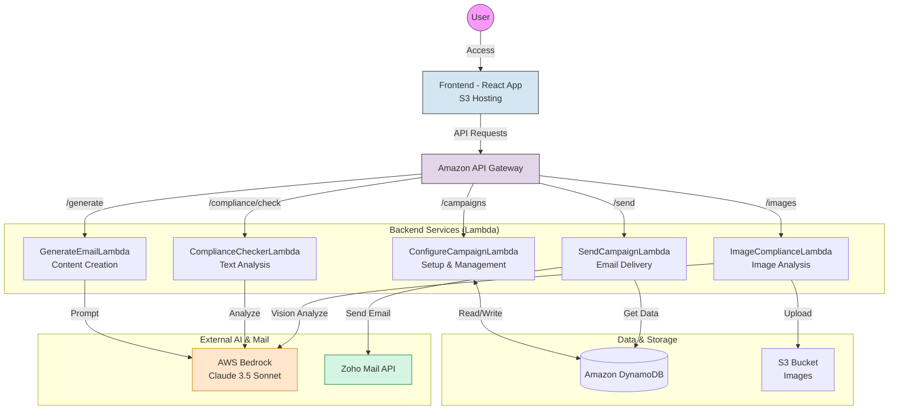

# Interon AI Email Agent 📧🤖

> **AI-Powered Email Campaign Management System** built with AWS Bedrock (Claude 3.5), Lambda, DynamoDB, and Zoho Mail. Now featuring **AI Compliance & Safety Checks**.

## 🚀 Quick Start

### View Live Application
**Frontend URL**: https://interon-email-agent-frontend-kamin.s3.us-east-2.amazonaws.com/index.html

### Project Structure
```
Emails Agent/
├── frontend/                    # React SPA (hosted on S3)
│   ├── index.html
│   └── assets/
│       ├── index-Cqena6zZ.js   # Main JS bundle
│       └── index-DsVhWXsy.css  # Styles
│
├── lambda-functions/            # AWS Lambda backend
│   ├── GenerateEmailLambda/    # AI email generation
│   ├── ConfigureCampaignLambda/# Campaign configuration
│   ├── ListCampaignsLambda/    # Campaign listing
│   ├── SendCampaignLambda/     # Email sending
│   ├── ComplianceCheckerLambda/# Text compliance (RegEx + AI)
│   └── ImageComplianceLambda/  # Image compliance (Claude Vision)
│
└── PROJECT_OVERVIEW.md          # Detailed architecture docs
```

## ✨ Features

### 🛡️ Compliance & Safety (New!)
- **Text Compliance**: Real-time analysis of email drafts for risky keywords (Visa, immigration status, discrimination).
- **Image Compliance**: **Claude 3.5 Sonnet Vision** analyzes uploaded images for EEOC violations or sensitive content before they are allowed in campaigns.
- **Hybrid Checking**: Uses fast Regex checking for instant feedback + Deep AI scan for context.

### 🎨 AI-Powered Email Generation
- Generate multiple email variations using **Claude 3.5 Sonnet**
- Customize tone, intent, and audience
- Automatic placeholder insertion (`{{first_name}}`, `{{company}}`, etc.)

### 📊 Campaign Management
- **Manual Mode**: Write your own templates
- **Auto Mode**: AI generates 1-10 variations automatically
- Round-robin template distribution to avoid spam filters

### 👥 Recipient Management
- Import recipient lists
- Automatic name extraction from email addresses
- Smart fallback logic for missing data

### 📧 Email Delivery
- Powered by **Zoho Mail API**
- Automatic OAuth token refresh
- Personalized content for each recipient
- Real-time status tracking (sent/failed)

## 🏗️ Architecture

### Tech Stack
- **Frontend**: React (Vite)
- **Backend**: AWS Lambda (Python 3.9/3.11)
- **Database**: Amazon DynamoDB
- **AI**: AWS Bedrock (Claude 3.5 Sonnet v2)
- **Email**: Zoho Mail API
- **Region**: us-east-2 (Ohio)

### System Workflow



```ascii
                                    +------------------+
                                    |   User Browser   |
                                    +--------+---------+
                                             |
                                             v
                                  +----------+-----------+
                                  |    S3 Frontend       |
                                  | (React Application)  |
                                  +----------+-----------+
                                             | HTTPS / JSON
                                             v
                                  +----------+-----------+
                                  |  Amazon API Gateway  |
                                  +----------+-----------+
                                             |
            +--------------------+-----------+-----------+-----------------------+
            |                    |           |           |                       |
            v                    v           v           v                       v
    +-------+-------+    +-------+--+    +---+---+   +---+---------+    +--------+-------+
    | Compliance    |    | Image    |    | GenAI |   | Campaign    |    | Send           |
    | Checker       |    | Checker  |    | Lambda|   | Config      |    | Campaign       |
    | Lambda        |    | Lambda   |    +---+---+   | Lambda      |    | Lambda         |
    +-------+-------+    +---+---+--+        |       +-------+-----+    +--------+-------+
            |                |   |           |               |                   |
            |     +----------+   |           v               v                   |
            v     v              |        +--+---+       +---+-------+           |
    +-------+-----+--+           |        | AWS  |       | DynamoDB  | <---------+
    | AWS Bedrock    | <---------+        |Claude|       | (Storage) |
    | (Claude 3.5)   |                    +------+       +-----------+
    +----------------+                                                           |
                                                                                 v
                                                                         +-------+-------+
                                                                         | Zoho Mail API |
                                                                         +---------------+
```

### AWS Resources

#### Lambda Functions
| Function | Runtime | Purpose |
|----------|---------|---------|
| `GenerateEmailLambda` | Python 3.9 | Generate AI email variations |
| `ConfigureCampaignLambda` | Python 3.11 | Configure campaign settings |
| `ListCampaignsLambda` | Python 3.9 | List campaigns with stats |
| `SendCampaignLambda` | Python 3.11 | Send personalized emails |
| `ComplianceCheckerLambda` | Python 3.11 | **[NEW]** Check text for EEOC/Visa violations |
| `ImageComplianceLambda` | Python 3.11 | **[NEW]** Check images using Bedrock Vision |

#### DynamoDB Tables
| Table | Primary Key | Purpose |
|-------|-------------|---------|
| `Campaigns` | `campaignId` | Store campaign configurations |
| `CampaignRecipients` | `campaignId`, `recipientId` | Store recipient data and status |

#### S3 Buckets
- **Frontend**: `interon-email-agent-frontend-kamin` (Static Website)
- **Images**: `interon-email-images` (Campaign Assets & Compliance Logic)

## 🔧 Development Setup

### Prerequisites
- AWS CLI installed and configured
- AWS credentials with access to us-east-2
- Node.js 16+ (for frontend development)
- Python 3.9+ (for Lambda development)

### Pull Code from AWS

```powershell
# Configure AWS credentials
aws configure set aws_access_key_id YOUR_ACCESS_KEY_ID
aws configure set aws_secret_access_key YOUR_SECRET_ACCESS_KEY
aws configure set region us-east-2

# Download frontend from S3
aws s3 sync s3://interon-email-agent-frontend-kamin/ ./frontend

# Download Lambda functions (Updated List)
$functions = @("GenerateEmailLambda", "SendCampaignLambda", "ListCampaignsLambda", "ConfigureCampaignLambda", "ComplianceCheckerLambda", "ImageComplianceLambda")
foreach ($fn in $functions) {
    # Note: Requires S3 bucket or getting function code location URL
    $url = aws lambda get-function --function-name $fn --region us-east-2 --query 'Code.Location' --output text
    Invoke-WebRequest -Uri $url -OutFile "./lambda-functions/$fn.zip"
    Expand-Archive -Path "./lambda-functions/$fn.zip" -DestinationPath "./lambda-functions/$fn" -Force
}
```

### Local Development

#### Frontend
```bash
cd frontend
npm install
npm run dev
```

#### Lambda Functions
Each Lambda function can be tested locally using the provided test scripts (e.g., `test-compliance.py`).

## 📝 API Usage

### Compliance Checks

#### Text Check
```bash
POST /compliance/check
Content-Type: application/json

{
  "subject": "H1B Job Offer",
  "body": "We are looking for OPT candidates..."
}
```
*Returns `isCompliant: false` with list of violations.*

#### Image Upload & Check
```bash
POST /images
Content-Type: application/json

{
  "image": "base64_encoded_string...",
  "filename": "job-post.jpg",
  "campaignId": "123"
}
```
*Returns `isCompliant: true` and public S3 URL if safe, or `400/Block` if violations found.*

### Campaign Operations

#### Generate Email Variations
```bash
POST /generate-email
{
  "intent": "Cold outreach",
  "tone": "Professional",
  "count": 3
}
```

#### Configure Campaign
```bash
POST /campaigns/{campaignId}/config
{
  "mode": "auto",
  "intent": "...",
  "audience": "..."
}
```

## 🔐 Environment Variables

### ConfigureCampaignLambda
```
CAMPAIGNS_TABLE=Campaigns
MODEL_ID=us.anthropic.claude-3-5-sonnet-20241022-v2:0
Bedrock Region: us-east-2
```

### ImageComplianceLambda
```
BUCKET_NAME=interon-email-images
MODEL_ID=us.anthropic.claude-3-5-sonnet-20241022-v2:0
```

## 📄 License

Proprietary - Interon AI

---

**Last Updated**: December 29, 2025  
**Maintained by**: Interon AI Team  
**AWS Region**: us-east-2 (Ohio)
